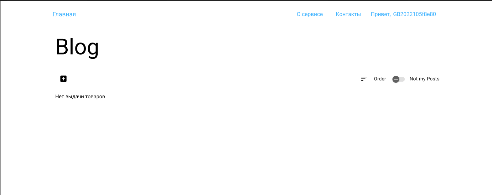
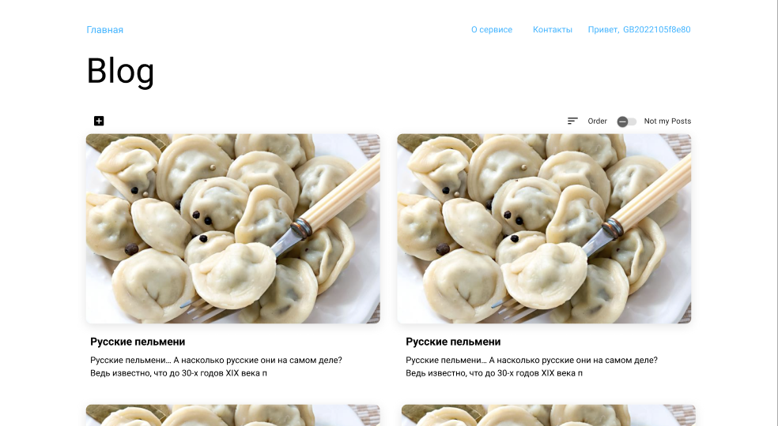
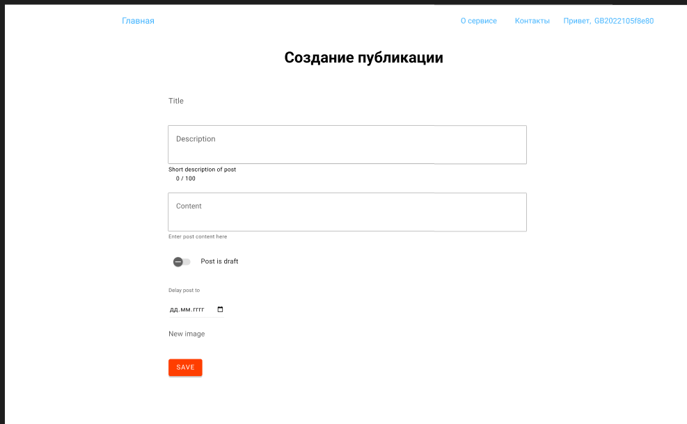
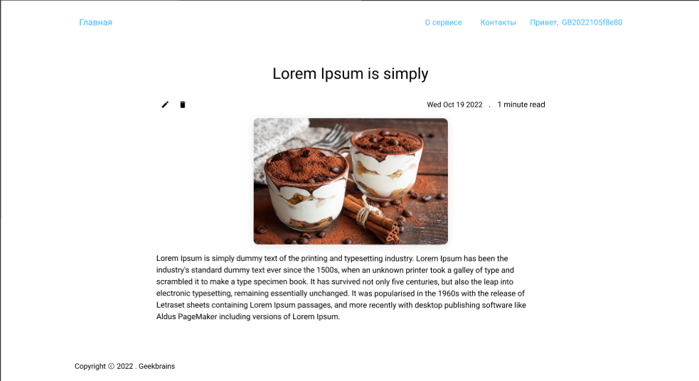
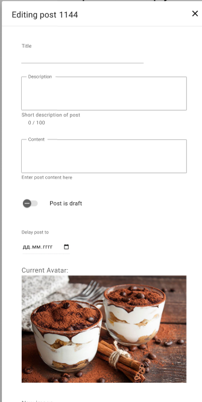
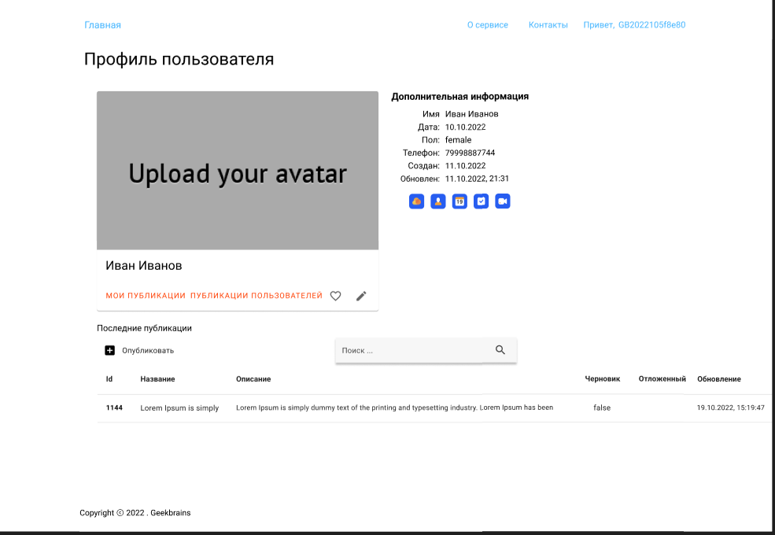
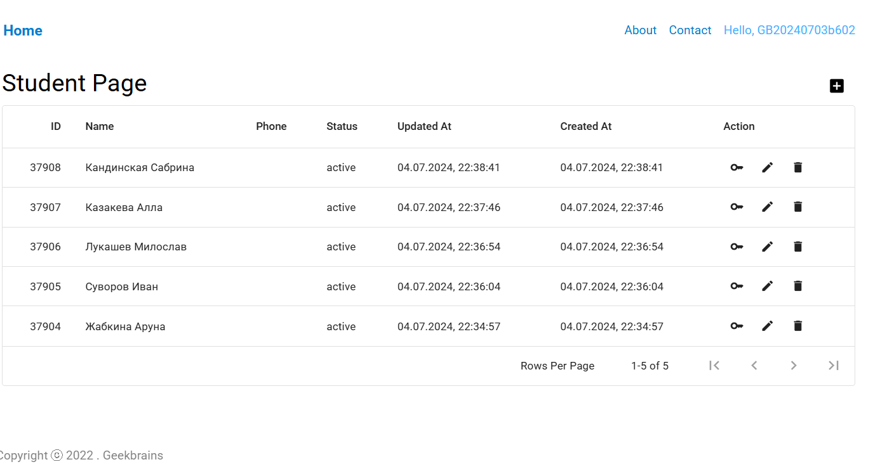

||Требование|Отработка ошибки|
|-|-|-|
|1|Страница доступна только авторизованным пользователям|API возвращает ошибку авторизации; фронт редиректит на страницу авторизации|
|1.1|Редактирование аватара доступно по клику на него|[Avatar](./User.txt)|
|1.2|По клику на карандаш под аватаром открывается попап редактирования данных пользователя|[Avatar](./User.txt)|
|1.3|По кнопке “Мои публикации” открывает стартовую страницу блога с личными постами|[New post](./Post.txt)|
|1.4|По кнопке “Публикации пользователей” открывает первую страницу с чужими постами|[New post](./Post.txt)|
|1.5|По кнопке + открывается попап создания нового поста|https://docs.google.com/spreadsheets/d/1KT9B95kwVe29UHsEm_B-pnPoOf5FB-9WKTLQEg3ATWw/edit?usp=sharing|
|1.6|По клику на карандашик рядом со списком постов открывается попап редактирования конкретного поста|[New post](./Post.txt)|
|1.7|По клику на урну пост удаляется|[New post](./Post.txt)|
|1.8|Можно искать посты по ID и заголовку|[New post](./Post.txt)|

